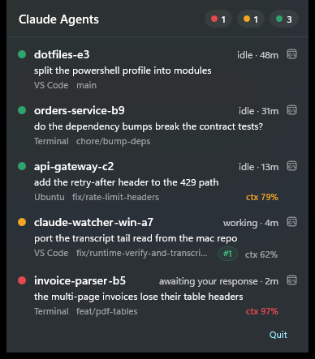

# Claude Watcher for Windows

A tiny **system-tray** app that shows which running Claude Code agent needs you —
at a glance, from anywhere on your desktop. The Windows sibling of
[claude-watcher](https://github.com/AKharytonchyk/claude-watcher) (macOS).

<p align="center">
  
</p>

- 🔴 **needs you** · 🟡 **working** · 🟢 **idle** — a traffic-light dot in the
  notification area, full breakdown in the tooltip and a Fluent flyout. The header
  badges double as filters: click one to hide that state.
- Watches **both** Claude Code running natively (PowerShell/cmd) **and** inside
  **WSL** distros, aggregated into one list and tagged by **hosting app** —
  Terminal, VS Code, or the distro name.
- Per agent: last intent, git branch, **open PR** (click to open it), and
  context-window pressure that turns amber then red as it fills. Click a row to
  bring its terminal or editor to the front.
- **Local-first, read-only, no daemon, never steals focus.** Same principles as
  the macOS app — see [CONSTITUTION.md](CONSTITUTION.md) and [PRIVACY.md](PRIVACY.md).

> *Screenshot uses invented demo data — reproduce it with
> [`tools/demo-data.ps1`](tools/demo-data.ps1), which never reads your real
> `~/.claude`.*

> **Status: alpha.** The pure-logic **Core is complete and tested** (64 unit tests),
> and the app has now been **run and verified on a real Windows 11 desktop** with
> live native **and** WSL sessions: tray glyph, tooltip, flyout, host detection,
> click-to-focus, PR lookup, filtering and the file watcher. Rough edges remain —
> no installer, no first-run "pin the tray icon" nudge, and display scaling other
> than 100% is unverified. See
> [`specs/0001-windows-tray-mvp.md`](specs/0001-windows-tray-mvp.md) for the plan
> and [AGENTS.md](AGENTS.md) for the per-file status.

## Stack

WinUI 3 (Windows App SDK) + C# / .NET 10 — Fluent design, mica/acrylic, automatic
light/dark. Tray icon via [`H.NotifyIcon`](https://github.com/HavenDV/H.NotifyIcon).
Unpackaged (no MSIX required) to keep distribution lean.

## Build (on Windows)

```powershell
dotnet build ClaudeWatcher.sln -c Debug
src/ClaudeWatcher/bin/x64/Debug/net10.0-windows10.0.19041.0/win-x64/ClaudeWatcher.exe
```

Requires the .NET 10 SDK; the Windows App SDK comes in via NuGet and is carried
in the app, so there is no workload or runtime to install. See
[AGENTS.md](AGENTS.md) for the full build/run/verify loop and prerequisites.

To see it populated without waiting for real agents:

```powershell
./tools/demo-data.ps1              # invented fleet, then launches the app
./tools/demo-data.ps1 -Stress      # absurd names/branches and 14 agents
./tools/check-layout.ps1           # assert nothing overlaps or leaves the screen
```

## Data source

Claude Code writes a small JSON file per live session under `~/.claude/sessions`.
That schema — the contract this app reads — is documented in
[SCHEMA.md](SCHEMA.md) and is identical across macOS, Windows, and WSL. Keep it in
sync with the [macOS repo](https://github.com/AKharytonchyk/claude-watcher).

## Related

- **macOS:** [AKharytonchyk/claude-watcher](https://github.com/AKharytonchyk/claude-watcher)
  — the original menu-bar app this is a sibling of. Same principles
  ([CONSTITUTION](CONSTITUTION.md)) and the same read-only session-file contract
  ([SCHEMA](SCHEMA.md)); the pure-logic core here is a port of its Swift model.

> The reciprocal link (macOS repo → this one) will be added once the Windows app
> is confirmed running on a real desktop.

## License

MIT © 2026 Artsiom Kharytonchyk
